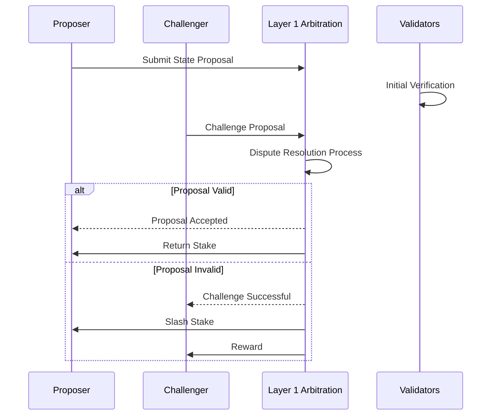

# Dispute Resolution in L2 Rollup Systems

## Fundamental Challenge

In decentralized systems, how do we create a trustless mechanism that:
- Prevents malicious actors from manipulating the system
- Provides economic incentives for honest behavior
- Allows for efficient dispute resolution
- Maintains system integrity without centralized control

## Core Dispute Resolution Principles

### 1. Economic Game Theory
- Design incentive structures that make honest behavior most profitable
- Create mechanisms where attacking the system is economically irrational
- Implement robust slashing conditions

### 2. Cryptoeconomic Security
- Financial stakes as a security mechanism
- Collateral-based verification
- Economic penalties for malicious actions

## Dispute Resolution Workflow

## Key Mechanism Design Considerations

1. **Stake Mechanisms**
   - Minimum required stake
   - Slashing conditions
   - Stake distribution rules

2. **Challenge Periods**
   - Duration of potential challenges
   - Verification window
   - Computational complexity of challenges

3. **Reward Structures**
   - Incentives for honest verification
   - Penalties for false claims
   - Proportional rewards

## Types of Potential Disputes

1. **State Transition Validity**
   - Challenging computational correctness
   - Verifying zero-knowledge proofs
   - Ensuring no invalid state changes

2. **Fraud Proofs**
   - Identifying malicious state proposals
   - Cryptographic challenge mechanisms
   - Efficient verification protocols

3. **Censorship Resistance**
   - Preventing systematic exclusion
   - Ensuring fair participation
   - Decentralization safeguards

## Undefined Research Areas

- Precise economic modeling
- Long-term game-theoretic stability
- Complex interaction scenarios
- Edge case handling
- Adaptive mechanism design

## Design Axes of Freedom

1. Stake Requirements
2. Challenge Window Duration
3. Reward Calculation Methods
4. Slashing Severity
5. Verification Computational Complexity

## Potential Implementation Strategies

1. **Optimistic Approach**
   - Assume validity by default
   - Allow challenges within a time window
   - Economically penalize false claims

2. **Proactive Verification**
   - Require cryptographic proof upfront
   - Minimal challenge window
   - High computational verification

3. **Hybrid Mechanisms**
   - Combine multiple verification strategies
   - Adaptive challenge protocols
   - Context-dependent resolution

## Open Research Questions

- How to model long-term system stability?
- What are optimal stake/reward ratios?
- How to handle complex dispute scenarios?
- Can we create self-healing mechanisms?

## Recommended Approach

1. Start with conservative, well-understood mechanisms
2. Implement flexible, upgradeable design
3. Create comprehensive simulation frameworks
4. Continuously monitor and adjust
5. Maintain transparency in mechanism design

## Key References

- Ethereum Research Dispute Resolution Papers
- Game Theory in Blockchain Systems
- Cryptoeconomic Security Literature
- Mechanism Design Academic Research