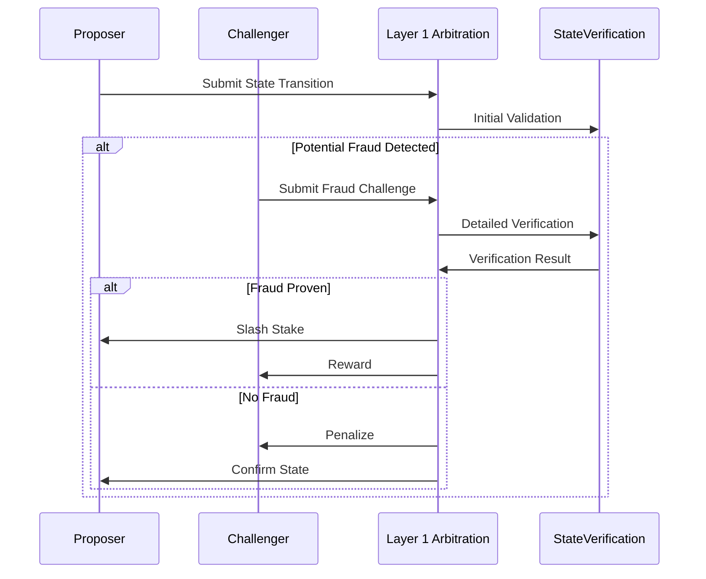

# Fraud Proof Mechanisms in L2 Rollup Systems

## Conceptual Framework

### Core Objective
Create a trustless verification system that:
- Detects invalid state transitions
- Provides economic incentives for verification
- Minimizes computational overhead
- Maintains system integrity

## Fraud Proof Types

### 1. Optimistic Fraud Proofs
- Assume state transitions are valid
- Allow challenges during a dispute window
- Economically penalize invalid claims

### 2. Interactive Fraud Proofs
- Multi-step verification process
- Incrementally narrow down dispute area
- Computational complexity trade-offs

## Verification Workflow

## Fraud Detection Strategies

### 1. Computational Trace Verification
- Validate each computational step
- Cryptographic proof of state transition
- Minimal information disclosure

### 2. State Root Comparison
- Compare proposed and expected state roots
- Merkle tree-based verification
- Efficient large-scale state checking

## Challenge Mechanism Design

### Challenge Initiation
- Economic stake required
- Time-bounded challenge window
- Computational complexity limits

### Resolution Protocols
- Multi-stage verification
- Incremental dispute narrowing
- Efficient arbitration mechanisms

## Economic Incentive Structures

1. **Challenge Rewards**
   - Compensation for successful fraud detection
   - Proportional to detected fraud magnitude
   - Encourages active verification

2. **Stake Mechanisms**
   - Minimum stake for participation
   - Slashing conditions for false challenges
   - Proportional economic risk

## Computational Complexity Considerations

- Verification computational cost
- Challenge resolution overhead
- Proof generation efficiency
- State transition complexity

## Design Flexibility Axes

1. Challenge Window Duration
2. Verification Computational Complexity
3. Reward Calculation Methods
4. Stake Requirements
5. Challenge Granularity

## Undefined Research Areas

- Advanced fraud detection techniques
- Complex multi-step challenge scenarios
- Adaptive verification mechanisms
- Edge case handling strategies

## Potential Implementation Approaches

1. **Minimal Verification**
   - Simple, computationally efficient checks
   - Low overhead
   - Basic fraud detection

2. **Comprehensive Verification**
   - Detailed computational trace analysis
   - High computational complexity
   - Thorough fraud detection

3. **Hybrid Mechanisms**
   - Layered verification strategies
   - Adaptive complexity
   - Context-dependent verification

## Open Research Questions

- Optimal verification computational trade-offs
- Handling sophisticated attack vectors
- Creating self-healing verification systems
- Balancing security and efficiency

## Recommended Design Principles

1. Start with conservative verification
2. Implement flexible upgrade paths
3. Maintain transparent challenge mechanisms
4. Create comprehensive simulation frameworks
5. Continuously monitor and improve

## Key References

- Fraud Proof Research Papers
- Blockchain Verification Mechanisms
- Cryptographic Verification Techniques
- Game Theory in Dispute Resolution