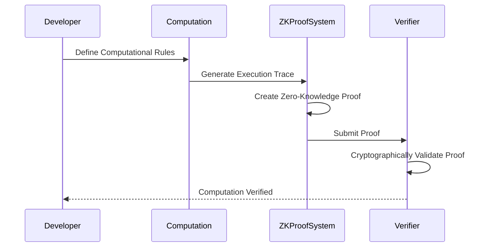

# Computational Verification in zkEVM

## What is Computational Verification?

### Core Concept
Proving that a computation was executed correctly without revealing the details of the computation.

### Kailua's Role
- Provides verification infrastructure
- Offers zero-knowledge proof generation tools
- Supports cryptographic state transition validation

## Computational Verification Workflow



## What Kailua Provides

### 1. Proof Generation Primitives
- RISC Zero verification contracts
- Proof generation interfaces
- Multiple proof type support (Groth16, Set Verification)

### 2. Verification Mechanisms
- `IRiscZeroVerifier`: Core verification interface
- `RiscZeroVerifierRouter`: Routing verification requests
- `RiscZeroGroth16Verifier`: Specific proof type handling

## Team's Design Responsibilities

### Computational Boundary Definition
- Specify valid computational operations
- Define state transition rules
- Create computational circuit constraints

### Proof Generation Strategy
- Choose appropriate proof generation method
- Design efficient computational circuits
- Minimize proof generation overhead

## Design Considerations

### 1. Computational Complexity
- Proof generation time
- Verification computational cost
- Circuit complexity

### 2. Verification Constraints
- What computations are provable?
- How to handle complex state transitions?
- Performance trade-offs

## Example Verification Scenario

```solidity
function verifyStateTransition(
    bytes memory computationTrace, 
    bytes memory proof
) external returns (bool) {
    // Team-defined validation logic
    bool isTraceValid = validateComputationTrace(computationTrace);
    
    // Kailua-provided verification
    bool isProofValid = riscZeroVerifier.verify(proof);
    
    return isTraceValid && isProofValid;
}
```

## Undefined Research Areas

- Precise computational boundary definitions
- Optimization of proof generation
- Handling complex multi-step computations
- Performance characteristics under various loads

## Recommended Approach

1. Start with simple, well-defined computations
2. Create comprehensive test circuits
3. Incrementally increase computational complexity
4. Develop robust error handling
5. Continuously benchmark performance

## Key Design Questions

- What specific computations need verification?
- How complex can our verification be?
- What are the performance limitations?
- How do we handle computational edge cases?

## Practical Steps

1. Define minimal computational set
2. Create sample computational circuits
3. Experiment with proof generation
4. Develop verification test suite
5. Iteratively expand computational complexity

## Tools and Resources

- RISC Zero Documentation
- Kailua Verification Contracts
- Zero-Knowledge Proof Research Papers
- Computational Circuit Design Guides