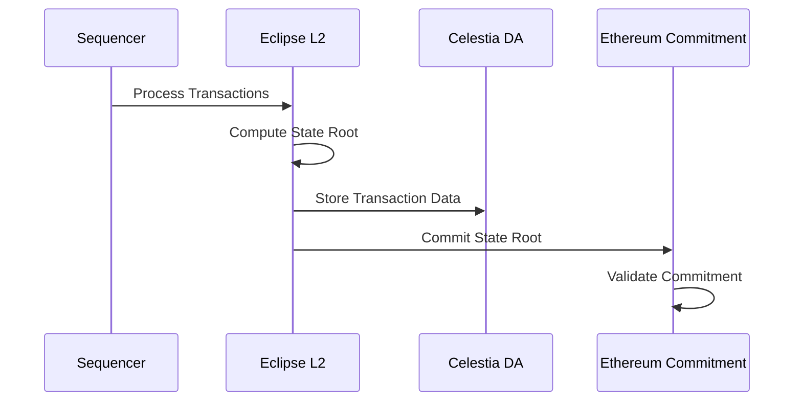

# State Commitment and Verification for Eclipse L2

## Architectural Context
- Rust-based Solana fork
- Single sequencer model
- Celestia data availability
- Ethereum commitment contract

## Core Verification Challenges

### Key Concerns
- Proving correct transaction processing
- Handling single sequencer architecture
- Addressing "proof of exclusion"
- Creating verifiable state commitments

## State Commitment Mechanism



## Verification Design Considerations

### 1. Transaction Block Verification
- Prove correct transaction processing
- Validate state transitions
- Ensure no unauthorized modifications

### 2. Proof of Exclusion Mechanism
- Cryptographically prove transactions not included
- Prevent sequencer censorship
- Provide transparency in transaction processing

## Potential Verification Approach

```solidity
contract EclipseStateCommitment {
    // Commit state root from L2
    function proposeStateRoot(
        bytes32 stateRoot,
        bytes32 transactionBlockHash,
        bytes memory proofData
    ) external {
        // Validate state root
        // Verify transaction block integrity
        // Enable dispute mechanism
    }

    // Challenge state root
    function challengeStateRoot(
        bytes32 proposedStateRoot,
        bytes memory exclusionProof
    ) external {
        // Verify proof of transaction exclusion
        // Validate state root incorrectness
        // Implement economic penalties
    }
}
```

## Design Challenges

### 1. Single Sequencer Limitations
- Centralization risk
- Trust assumptions
- Potential censorship vectors

### 2. Verification Complexity
- No direct EVM opcode mapping
- Different computational model
- Unique state transition rules

## Verification Strategy

### Key Components
1. Transaction block validation
2. State root computation
3. Proof of exclusion mechanism
4. Dispute resolution framework

### Required Research Inputs
- Precise state transition rules
- Transaction processing methodology
- Cryptographic proof generation strategy
- Performance and security characteristics

## Proof Generation Considerations

### Verification Approach
- Focus on transaction block integrity
- Prove correct state root computation
- Enable challenge mechanisms
- Minimize cryptographic complexity

### Potential Proof Types
- Transaction block validity proof
- State transition proof
- Proof of exclusion
- Challenge response proof

## Undefined Research Areas

- Exact proof generation methodology
- Performance characteristics
- Precise challenge mechanism design
- Handling edge case scenarios

## Recommended Approach

1. Start with minimal, provable design
2. Focus on transaction block verification
3. Create flexible challenge mechanisms
4. Minimize cryptographic complexity
5. Prioritize performance and security

## Key Design Questions

- How to prove transaction block correctness?
- What constitutes a valid state root?
- How to handle potential sequencer manipulation?
- What are the performance limitations?

## Collaboration Requirements

- Detailed specification from research team
- Clear state transition rules
- Proof generation methodology
- Performance benchmarks

## Success Criteria

- Robust state commitment mechanism
- Effective dispute resolution
- Minimal cryptographic complexity
- High performance and security
- Transparent transaction processing

## Conclusion

State commitment for Eclipse L2 requires:
- Careful design of verification mechanisms
- Focus on transaction block integrity
- Flexible, performant proof generation
- Minimal cryptographic innovation