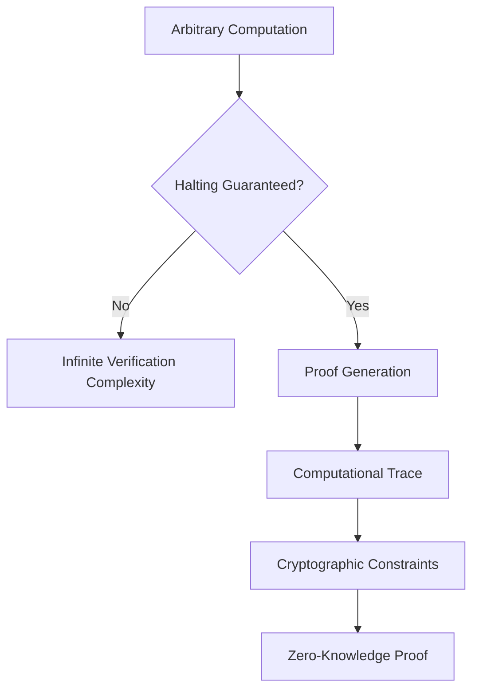

# The Quest for a Generalized zkEVM Circuit

## The Generalization Paradox

### Current Landscape
- Multiple zkEVM implementations
- Each with unique design approaches
- No universally accepted "one circuit to rule them all"

## Why Generalization is Challenging

### 1. Computational Complexity
- EVM is Turing-complete
- Infinite possible computational paths
- Exponential verification overhead

### 2. Cryptographic Constraints
- Different proof systems (SNARKs, STARKs)
- Varying cryptographic primitives
- Performance vs. generality trade-offs

## Existing Approaches

### 1. Specialized zkEVM Implementations
- Polygon zkEVM
- zkSync Era
- Scroll
- StarkWare

### Comparative Analysis

| Implementation | Approach | Generality | Performance | Complexity |
|---------------|----------|------------|-------------|------------|
| Polygon | Circuit-based | Moderate | High | Complex |
| zkSync | STARK-based | High | Moderate | Very Complex |
| Scroll | Recursive Proof | High | Moderate | Extremely Complex |
| StarkWare | State Transition | Very High | Low | Highly Theoretical |

## Theoretical Barriers to Generalization

### Computational Halting Problem
- Proving arbitrary computation termination
- Undecidability in Turing-complete systems
- Fundamental mathematical limitation

### Proof Generation Overhead

## Research Frontiers

### 1. Universal Circuit Approaches
- RISC-V based universal circuits
- Abstract machine models
- Computational trace abstraction

### 2. Recursive Proof Composition
- Breaking complex computations into verifiable subcomponents
- Hierarchical proof generation
- Modular verification strategies

## Potential Generalization Strategies

### 1. Abstraction Layers
- Create meta-circuit framework
- Define computational primitive constraints
- Allow dynamic circuit composition

### 2. Probabilistic Verification
- Sample-based computational verification
- Statistical proof of correctness
- Reduced computational overhead

## Cryptographic Research Challenges

1. Infinite Computational Paths
2. Performance Scaling
3. Cryptographic Primitive Selection
4. Verification Complexity
5. Computational Overhead

## Emerging Approaches

### 1. STARK-Based Universal Circuits
- Probabilistic verification
- Highly scalable
- Reduced deterministic constraints

### 2. Recursive SNARK Composition
- Modular proof generation
- Hierarchical verification
- Dynamic circuit adaptation

## Philosophical Implications

### Computational Verification Limits
- Gödel's Incompleteness Theorems
- Limits of formal verification
- Fundamental mathematical constraints

## Practical Recommendations

1. Accept partial generalization
2. Create flexible circuit frameworks
3. Develop adaptive verification strategies
4. Maintain computational efficiency
5. Continuously research boundary conditions

## Open Research Questions

- Can a truly universal zkEVM exist?
- What are the fundamental verification limits?
- How to balance generality and performance?
- Can we create self-modifying verification circuits?

## Collaboration and Research

- Interdisciplinary approach
- Combine:
  - Cryptography
  - Computational Theory
  - Mathematical Logic
  - Distributed Systems Design

## Conclusion: The Generalization Myth

A completely generalized zkEVM is likely:
- Theoretically impossible
- Computationally intractable
- A philosophical challenge more than an engineering problem

### Pragmatic Path Forward
- Develop flexible, adaptive circuits
- Create modular verification frameworks
- Accept probabilistic verification approaches
- Continuously push computational boundaries