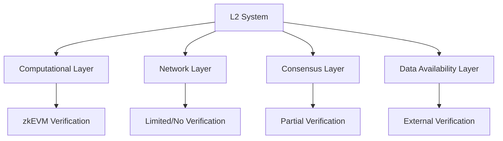

# zkEVM Verification Scope in L2 Systems

## Verification Boundaries

### What Can Be Verified?
- Computational state transitions
- Smart contract execution correctness
- Transaction processing integrity
- State root calculations

### What Cannot Be Verified?
- External system interactions
- Off-chain data integrity
- Network-level behaviors
- Consensus mechanism correctness

## Verification Layers



## Computational Layer Verification

### Provable Aspects
- Smart contract execution
- State transition calculations
- Transaction processing logic
- Internal computational integrity

### Verification Mechanisms
- Trace-based proof generation
- Cryptographic state root validation
- Constraint satisfaction proofs

## Limitations and Challenges

### 1. Computational Boundary
- Only verifies deterministic computations
- Cannot prove non-deterministic behaviors
- Limited to explicit computational steps

### 2. External Interaction Constraints
- No direct verification of:
  - Oracle interactions
  - Cross-chain communications
  - External API calls

## Verification Depth

### Levels of Verification
1. **Minimal Verification**
   - Basic computational correctness
   - Simple state transition proofs
   - Limited computational scope

2. **Comprehensive Verification**
   - Complex smart contract execution
   - Detailed state transition analysis
   - Multiple computational paths

3. **Advanced Verification**
   - Recursive proof composition
   - Multi-step computational verification
   - Complex state transition modeling

## Practical Verification Scenario

```solidity
contract L2VerificationSystem {
    // Verify specific computational aspects
    function verifyStateTransition(
        bytes memory executionTrace,
        bytes32 initialState,
        bytes32 finalState
    ) public returns (bool) {
        // Verify:
        // 1. Computational correctness
        // 2. State transition validity
        // 3. Transaction processing integrity
    }

    // Limitations exist beyond this verification
}
```

## Verification Scope Breakdown

### Fully Verifiable
- Smart contract execution
- Internal state transitions
- Transaction processing logic
- Computational state calculations

### Partially Verifiable
- Block production correctness
- Transaction ordering
- Basic consensus rules

### Non-Verifiable
- Network-level behaviors
- External system interactions
- Complex consensus mechanisms
- Off-chain data integrity

## Economic and Security Implications

### Verification Gaps
- Cannot guarantee complete system correctness
- Requires additional verification layers
- Potential attack vectors in unverified domains

### Mitigation Strategies
- Multi-layered verification approaches
- Complementary verification mechanisms
- Robust economic incentive designs

## Research Frontiers

### Expanding Verification Scope
- Recursive proof techniques
- Advanced cryptographic primitives
- More comprehensive verification strategies

### Open Research Questions
- How to verify non-deterministic behaviors?
- Can we create more comprehensive proof systems?
- What are the fundamental verification limits?

## Practical Recommendations

1. Understand precise verification boundaries
2. Design complementary verification mechanisms
3. Create economic incentives for system integrity
4. Develop multi-layered security approaches
5. Continuously research verification expansion

## Collaboration and Approach

- Interdisciplinary research
- Combine:
  - Cryptography
  - Distributed systems
  - Economic mechanism design
  - Security engineering

## Conclusion: Nuanced Verification

zkEVM provides:
- Strong computational integrity proofs
- Limited but critical verification
- Foundation for more comprehensive systems

### Key Insight
Verification is a spectrum, not a binary state
- Focus on expanding verification capabilities
- Accept and design around current limitations

## Recommended Next Steps

1. Map precise verification boundaries
2. Design complementary verification layers
3. Create economic incentive structures
4. Develop robust security frameworks
5. Continuously research verification expansion