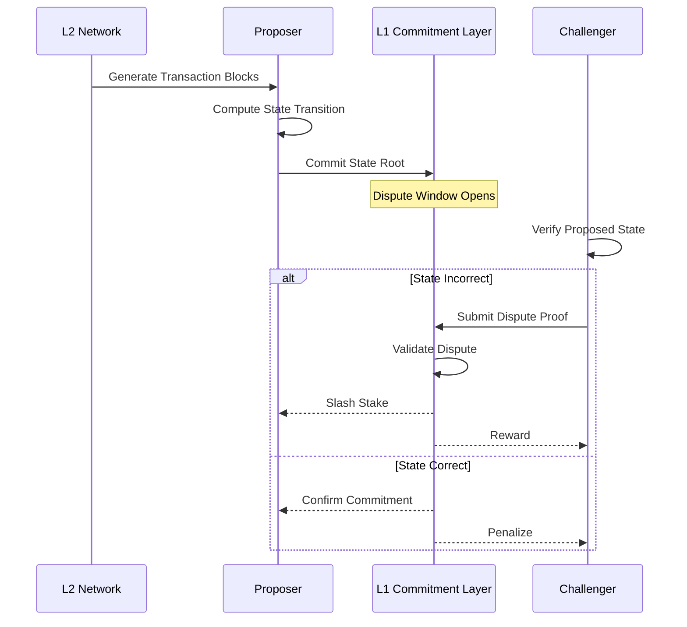

# L2 State Commitment and Dispute Resolution

## State Commitment Lifecycle

### Core Verification Process
1. L2 Generates Transaction Blocks
2. Compute State Transition
3. Generate Cryptographic Proof
4. Commit State Root to L1
5. Allow Dispute Window

## Verification Workflow



## Dispute Resolution Mechanism

### Verification Components
1. **Transaction Block Verification**
   - Validate individual transaction correctness
   - Ensure computational integrity
   - Check state transition rules

2. **Cryptographic Proof Generation**
   - Create zero-knowledge proof of state transition
   - Demonstrate computational validity
   - Minimize information disclosure

3. **Dispute Submission**
   - Provide verifiable computation proving incorrect state
   - Cryptographically challenge proposed state root
   - Economic incentives for correct challenges

## Practical Implementation Concept

```solidity
contract L2StateCommitment {
    // Commit state root from L2
    function proposeStateRoot(
        bytes32 stateRoot, 
        bytes memory transactionBlocks,
        bytes memory zkProof
    ) external {
        // Validate initial state root
        // Store proposed commitment
        // Open dispute window
    }

    // Submit dispute with computational proof
    function challengeStateRoot(
        bytes32 proposedStateRoot,
        bytes memory disputeProof
    ) external {
        // Verify dispute computational trace
        // Validate state transition incorrectness
        // Slash proposer if dispute valid
        // Reward challenger
    }
}
```

## Dispute Verification Strategy

### 1. Computational Trace Analysis
- Replay transaction blocks
- Verify state transition calculations
- Detect computational inconsistencies

### 2. Zero-Knowledge Proof Validation
- Cryptographically prove computational errors
- Minimal information disclosure
- Efficient verification mechanism

## Economic Incentive Design

### Challenger Motivation
- Economic reward for valid disputes
- Stake slashing for incorrect challenges
- Proportional compensation

### Proposer Constraints
- Minimum stake requirement
- Economic penalty for incorrect state roots
- Reputation tracking

## Verification Complexity

### Computational Considerations
- Efficient proof generation
- Minimal verification overhead
- Scalable dispute resolution

### Cryptographic Requirements
- Zero-knowledge proof generation
- State transition validation
- Minimal computational complexity

## Design Flexibility Axes

1. Dispute window duration
2. Stake requirements
3. Challenge reward calculations
4. Verification computational complexity
5. Proof generation strategies

## Undefined Research Areas

- Optimal dispute resolution mechanisms
- Complex state transition scenarios
- Performance under high-frequency challenges
- Long-term economic stability

## Recommended Approach

1. Start with conservative dispute mechanisms
2. Create flexible, upgradeable design
3. Implement comprehensive simulation frameworks
4. Continuously monitor and adjust
5. Maintain transparent verification processes

## Key Design Challenges

- Balancing verification efficiency
- Creating robust economic incentives
- Handling complex computational scenarios
- Minimizing verification overhead

## Collaboration and Research

- Interdisciplinary approach
- Combine:
  - Cryptography
  - Game theory
  - Distributed systems design
  - Economic mechanism research

## Conclusion: Verifiable State Transitions

L2 state commitment is a delicate balance of:
- Computational integrity
- Economic incentives
- Cryptographic verification
- Dispute resolution mechanisms

### Core Principle
Create a system where:
- Honest behavior is most profitable
- Computational errors are economically punished
- Verification is efficient and scalable