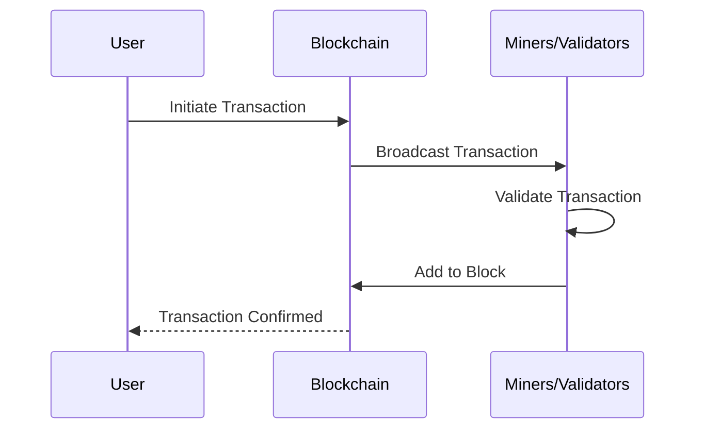

# Blockchain Fundamentals for L2 Rollup Understanding

## Core Blockchain Concepts

### 1. Decentralized Ledger
- Distributed database maintained by multiple nodes
- Immutable record of transactions
- Consensus mechanisms ensure data integrity

### 2. Cryptographic Primitives
- Public/Private Key Cryptography
- Digital Signatures
- Hash Functions
- Merkle Trees

### 3. Consensus Mechanisms
- Proof of Work (PoW)
- Proof of Stake (PoS)
- Delegated Proof of Stake (DPoS)

## Transaction Lifecycle

## Key Security Principles

1. Cryptographic Verification
2. Decentralized Trust
3. Immutability
4. Transparency
5. Consensus-Driven Validation

## Recommended Background Knowledge

- Basic cryptography understanding
- Programming fundamentals
- Distributed systems concepts
- Network security principles

## Learning Resources

- Mastering Bitcoin by Andreas Antonopoulos
- Cryptography courses on Coursera/edX
- Blockchain developer tutorials
- Cryptographic algorithm studies