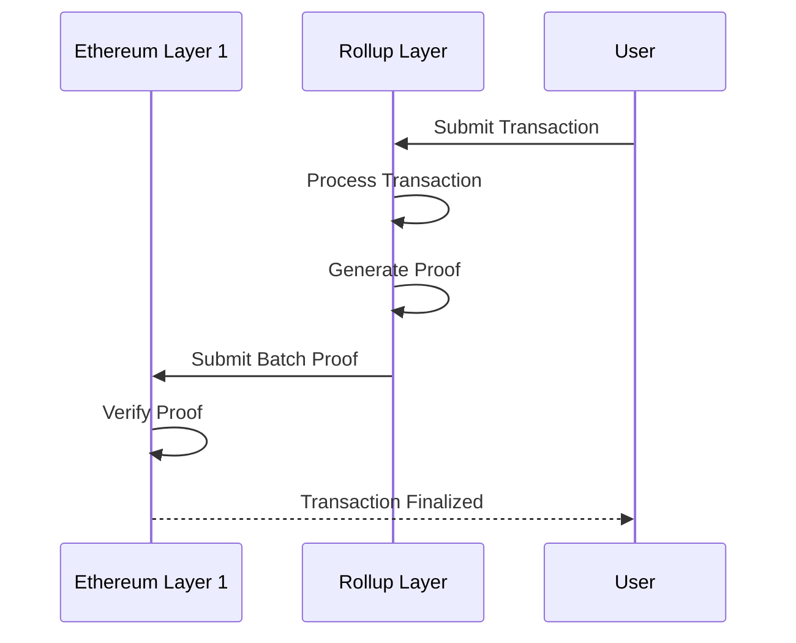

# Layer 2 Rollup Concepts

## What are Layer 2 Rollups?

Layer 2 rollups are scaling solutions that process transactions outside the main Ethereum blockchain (Layer 1) while maintaining the security guarantees of the base layer.

## Types of Rollups

### 1. Optimistic Rollups
- Assume transactions are valid by default
- Provide a challenge period for fraud proofs
- Lower computational overhead

### 2. Zero-Knowledge (ZK) Rollups
- Cryptographically prove transaction validity
- Immediate transaction finality
- Higher computational complexity
- Better privacy guarantees

## Rollup Interaction Flow

## Key Characteristics

1. **Scalability**
   - Higher transaction throughput
   - Lower transaction costs
   - Reduced network congestion

2. **Security**
   - Inherit security from base layer
   - Cryptographic verification
   - Fraud/validity proofs

3. **State Management**
   - Maintain state root on Layer 1
   - Periodic state synchronization
   - Dispute resolution mechanisms

## Challenges

- Proof generation complexity
- Computational overhead
- Cross-layer communication
- Finality and confirmation times

## Zero-Knowledge Proof Mechanisms

### Proof Generation
1. Compute state transition
2. Generate cryptographic proof
3. Verify proof on Layer 1

### Verification Process
- Validate computational integrity
- Verify state transitions
- Ensure no invalid state changes

## Recommended Understanding

- Advanced cryptography concepts
- Computational complexity theory
- Distributed systems design
- Cryptographic proof systems

## Learning Path

1. Understand basic blockchain concepts
2. Study zero-knowledge proof mechanisms
3. Explore Layer 2 scaling solutions
4. Analyze existing rollup implementations

## Key References

- Vitalik Buterin's Rollup Writings
- RISC Zero Documentation
- Ethereum Rollup Research Papers
- Zero-Knowledge Proof Tutorials