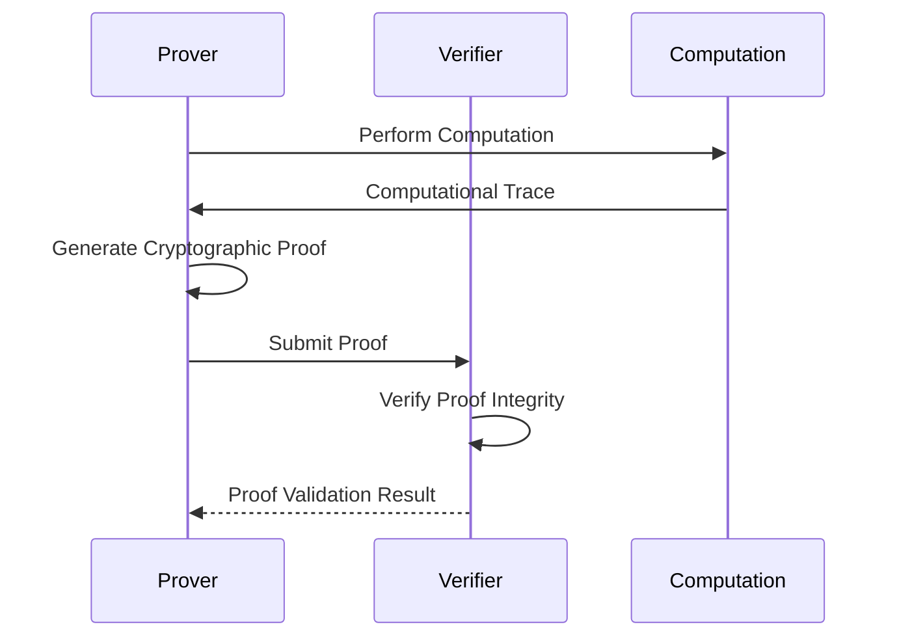
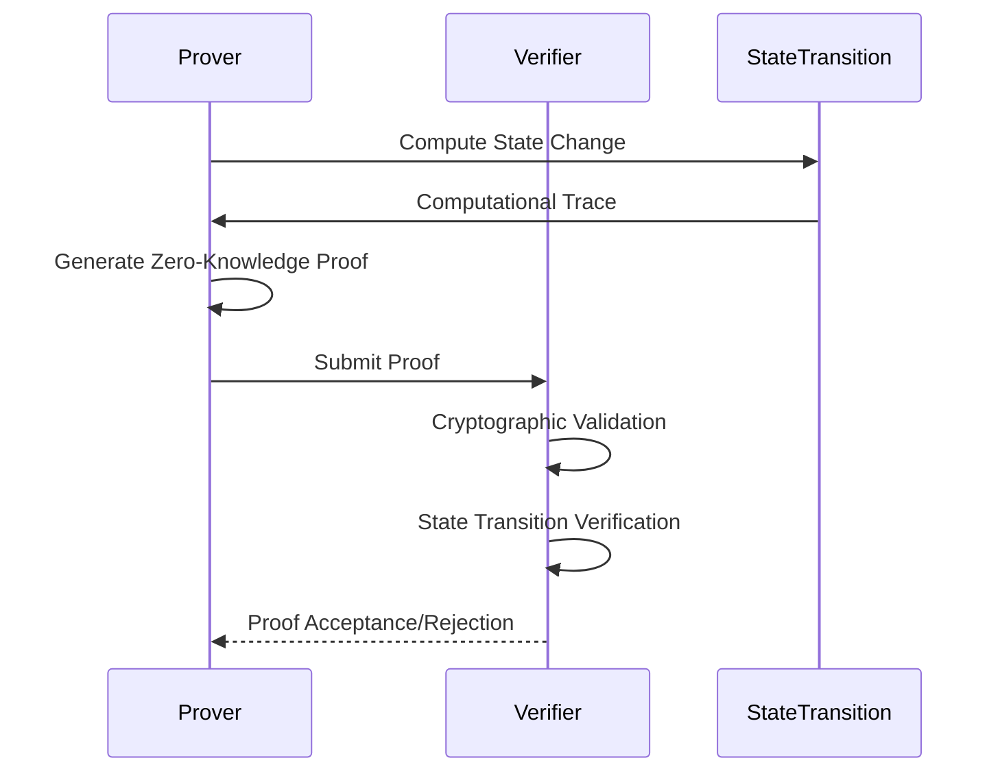

# Zero-Knowledge Proofs: Fundamental Concepts

## What are Zero-Knowledge Proofs?

A cryptographic method allowing one party (prover) to prove to another party (verifier) that a statement is true without revealing any additional information.

## Core Principles

### 1. Completeness
- Honest prover can always convince honest verifier

### 2. Soundness
- Dishonest prover cannot convince verifier of false statement

### 3. Zero-Knowledge
- No information beyond statement's truth is revealed

## Proof Types

### 1. Interactive Zero-Knowledge Proofs
- Prover and verifier exchange multiple messages
- Probabilistic verification

### 2. Non-Interactive Zero-Knowledge (NIZK) Proofs
- Single message proof
- No ongoing interaction required

## Proof Generation Flow

## Common Zero-Knowledge Proof Systems

### 1. zk-SNARKs (Zero-Knowledge Succinct Non-Interactive Arguments of Knowledge)
- Compact proofs
- Constant verification time
- Complex setup phase

### 2. zk-STARKs (Zero-Knowledge Scalable Transparent Arguments of Knowledge)
- No trusted setup
- Quantum-resistant
- Larger proof sizes

## Computational Complexity

- Proof Generation: Computationally Expensive
- Proof Verification: Relatively Inexpensive
- Logarithmic Verification Complexity

## Use Cases

1. Privacy Preservation
2. Blockchain Scalability
3. Secure Computation
4. Identity Verification
5. Confidential Transactions

## Verification Mechanisms

## Mathematical Foundations

- Elliptic Curve Cryptography
- Computational Complexity Theory
- Discrete Logarithm Problem
- Homomorphic Encryption

## Recommended Background

- Advanced Cryptography
- Abstract Algebra
- Computational Theory
- Discrete Mathematics

## Learning Resources

- "Introduction to Modern Cryptography"
- Coursera Cryptography Courses
- Academic Papers on Zero-Knowledge Proofs
- RISC Zero Technical Documentation

## Practical Considerations

1. Performance Trade-offs
2. Computational Overhead
3. Proof Generation Complexity
4. Verification Mechanisms
5. Security Assumptions