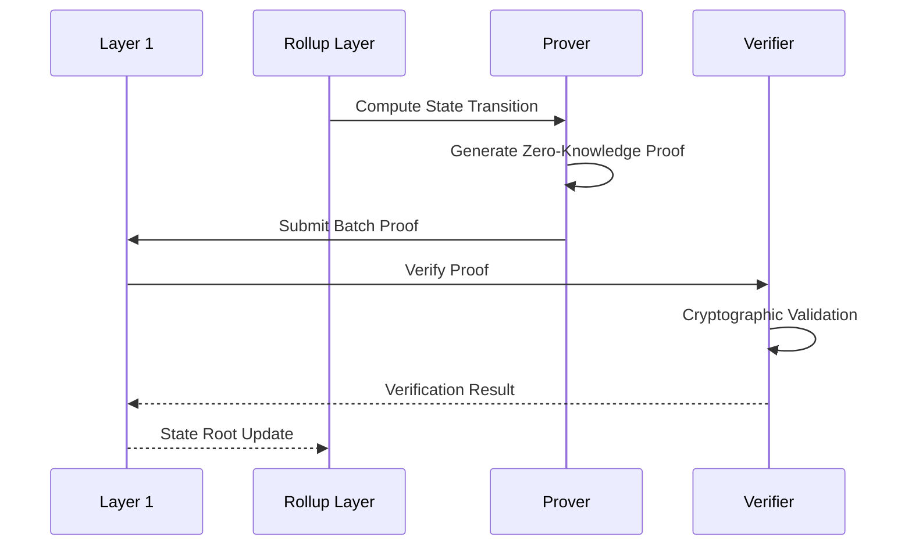

# Cryptographic Verification in Blockchain Systems

## Verification Fundamentals

### Core Objectives
- Ensure data integrity
- Validate computational correctness
- Prevent unauthorized state modifications
- Maintain system trustlessness

## Verification Mechanisms

### 1. Cryptographic Signatures
- Public/Private Key Authentication
- Non-repudiation
- Identity Verification

### 2. Merkle Tree Proofs
- Efficient data integrity verification
- Compact representation of large datasets
- Used in blockchain state root verification

## Verification Process Flow

```mermaid
sequenceDiagram
    participant Prover
    participant Verifier
    participant System

    Prover->>System: Compute State/Transaction
    System->>Prover: Computational Trace
    Prover->>Prover: Generate Cryptographic Proof
    Prover->>Verifier: Submit Proof + Metadata
    Verifier->>Verifier: Cryptographic Validation
        - Signature Check
        - Merkle Path Verification
        - Computational Integrity
    Verifier-->>Prover: Verification Result
```

## Verification Types

### 1. Signature Verification
- Validate message origin
- Ensure message integrity
- Prevent tampering

### 2. State Transition Verification
- Validate computational correctness
- Ensure no invalid state changes
- Maintain system consistency

### 3. Proof Verification
- Validate zero-knowledge proofs
- Check computational integrity
- Verify without revealing computation details

## Cryptographic Primitives

1. Hash Functions
   - Collision Resistance
   - One-Way Transformation
   - Fixed-Length Output

2. Digital Signatures
   - ECDSA (Elliptic Curve Digital Signature Algorithm)
   - EdDSA (Edwards-Curve Digital Signature Algorithm)

3. Commitment Schemes
   - Hide original value
   - Allow later verification

## Verification Challenges

- Computational Complexity
- Proof Generation Overhead
- Verification Time
- Storage Requirements

## Security Considerations

1. Cryptographic Assumptions
2. Side-Channel Attacks
3. Quantum Computing Threats
4. Implementation Vulnerabilities

## Verification in Rollup Context



## Recommended Skills

- Cryptography Fundamentals
- Discrete Mathematics
- Computational Complexity Theory
- Elliptic Curve Mathematics
- Secure Coding Practices

## Learning Resources

- Cryptography textbooks
- Online cryptography courses
- Academic research papers
- NIST Cryptographic Standards
- Blockchain security workshops

## Practical Considerations

1. Choose Appropriate Verification Mechanism
2. Understand Computational Trade-offs
3. Implement Robust Error Handling
4. Stay Updated on Cryptographic Research
5. Consider Future Quantum Threats